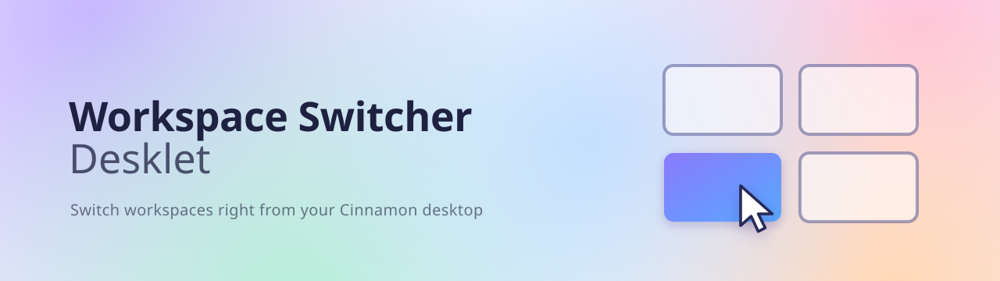
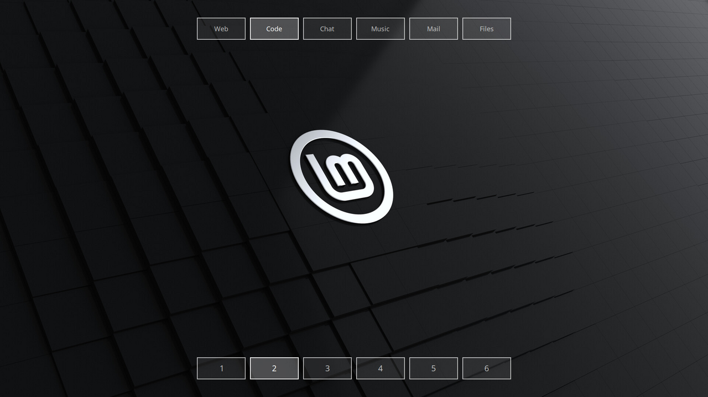

<p align="center">
  
</p>

<p align="center">
  One translucent rectangle per workspace, right on your Cinnamon desktop.<br>
  Click or scroll to switch.
</p>

<p align="center">
  
</p>

---

## Features

- **One rectangle per workspace**, updated live as workspaces are added or removed
- **Click** to switch, **scroll** to move to the previous or next workspace
- **Any layout**: horizontal, vertical, or a grid (N per row or column)
- **9 screen positions** (corners, edges, center) or free drag, with an edge margin
- **Multi-monitor**: show it on the primary monitor, a specific one, or all of them
- **Multiple instances**: for example one at the top and one at the bottom of the screen
- **Full styling**: size, border width, corner radius, shadow, and separate colors for normal, hover and active
- **Labels**: numbers, Roman numerals, letters (upper or lower case), or workspace names, with custom names per workspace

## Installation

```bash
git clone https://github.com/mgldvd/workspace-switcher-desklet.git
cp -r workspace-switcher-desklet/workspace-switcher-desklet@mgldvd/files/workspace-switcher-desklet@mgldvd \
  ~/.local/share/cinnamon/desklets/
```

To use the translations, compile them into your locale folder (needs `gettext`):

```bash
cd workspace-switcher-desklet/workspace-switcher-desklet@mgldvd/files/workspace-switcher-desklet@mgldvd
for po in po/*.po; do
  lang=$(basename "$po" .po)
  mkdir -p ~/.local/share/locale/$lang/LC_MESSAGES
  msgfmt "$po" -o ~/.local/share/locale/$lang/LC_MESSAGES/workspace-switcher-desklet@mgldvd.mo
done
```

Then right-click the desktop → **Add Desklets** → **Workspace Switcher Desklet**.

## Settings

Right-click the desklet → **Configure**.

| Tab | Options |
|---|---|
| **Layout** | Monitor · Position · Margin · Orientation · Rectangles per row/column · Spacing |
| **Rectangles** | Width · Height · Drop shadow · Border width (normal / active) · Corner radius |
| **Colors** | Background and border, each for normal, hover and active workspace (with transparency) |
| **Label** | None · 1 2 3 · I II III · i ii iii · A B C · a b c · Workspace name · Custom names per workspace · Font size · Bold · Text colors |
| **Behavior** | Scroll to switch · Wrap around at first/last workspace |

## Recreate the screenshot

The screenshot uses two instances of the desklet with the default colors: names along the top, numbers along the bottom. Both use the same size and spacing, so their rectangles line up.

1. Set up 6 workspaces. The desklet always shows every workspace.
2. Add the desklet **twice** (right-click the desktop → **Add Desklets**).
3. Right-click each one → **Configure** and set these options. Anything not listed keeps its default.

| Tab | Setting | Top instance | Bottom instance |
|---|---|---|---|
| Layout | Position | Top center | Bottom center |
| Layout | Margin from screen edge | 48 px | 48 px |
| Layout | Spacing between rectangles | 12 px | 12 px |
| Rectangles | Width × Height | 132 × 60 px | 132 × 60 px |
| Rectangles | Border width (normal and active) | 2 px | 2 px |
| Rectangles | Corner radius | 0 px | 0 px |
| Label | Show | Workspace name | Number (1, 2, 3) |
| Label | Custom names | 1 Web · 2 Code · 3 Chat · 4 Music · 5 Mail · 6 Files | — |
| Label | Font size | 18 px | 22 px |

> [!TIP]
> Want the pair on every screen? Set **Monitor** to **All monitors** on both instances.

## Development

The repository follows the official [Cinnamon Spices](https://github.com/linuxmint/cinnamon-spices-desklets) layout, so the `workspace-switcher-desklet@mgldvd/` folder can be submitted as is:

```
workspace-switcher-desklet@mgldvd/
├── README.md, banner.png      # page on the Spices website
├── info.json                  # Spices metadata (author)
├── screenshot.png             # shown on the Spices website
└── files/workspace-switcher-desklet@mgldvd/
    ├── desklet.js
    ├── metadata.json
    ├── settings-schema.json
    ├── icon.png, icon.svg
    └── po/                    # translation template (.pot) and translations (.po)
```

Symlink the desklet instead of copying it, so your edits are what Cinnamon loads:

```bash
ln -s "$PWD/workspace-switcher-desklet@mgldvd/files/workspace-switcher-desklet@mgldvd" \
  ~/.local/share/cinnamon/desklets/
```

Reload it after a change:

```bash
dbus-send --session --dest=org.Cinnamon --type=method_call /org/Cinnamon \
  org.Cinnamon.ReloadXlet string:'workspace-switcher-desklet@mgldvd' string:'DESKLET'
```

Logs go to `~/.xsession-errors`, or open Looking Glass with <kbd>Alt</kbd>+<kbd>F2</kbd> → `lg`.

## Testing

**Official checks.** Runs the same checks as the Cinnamon Spices CI: [`validate-spice`](https://github.com/linuxmint/cinnamon-spices-desklets/blob/master/validate-spice) (layout, `info.json`, `metadata.json`, icon) and the [Pattern Check](https://github.com/linuxmint/github-actions/tree/master/pattern-checker) rules (deprecated and forbidden APIs). Both are downloaded on every run, so they always match the current rules. Needs `python3-pil`, `python3-yaml` and network access.

```bash
tests/official_checks.py
```

**Live test.** Drives the desklet running in your session: it changes each setting the way the settings dialog does and checks the result on screen (layout, sizes, colors, labels, positions, monitors, mouse wheel). Your settings, position and active workspace are restored at the end. Add the desklet to your desktop first.

```bash
tests/live_test.py
```

## Translations

The settings window, name and description are available in:

Español · Português (Brasil) · Deutsch · Français · Русский · Italiano · Polski · 简体中文

They use the same terms Cinnamon uses in each language. To add a language, copy `po/workspace-switcher-desklet@mgldvd.pot` to `po/<lang>.po` and translate it, for example with [Poedit](https://poedit.net/).

If you change a string in `settings-schema.json` or `metadata.json`, regenerate the template with Cinnamon's own tool (needs `python3-polib`):

```bash
cinnamon-xlet-makepot workspace-switcher-desklet@mgldvd/files/workspace-switcher-desklet@mgldvd
```

## Compatibility

Tested on Cinnamon 6.6.

## License

Copyright © 2026 mgldvd

Released under the [GNU General Public License v3.0](LICENSE).
